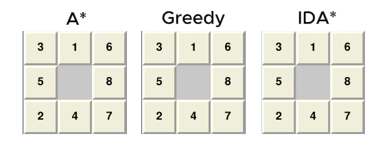
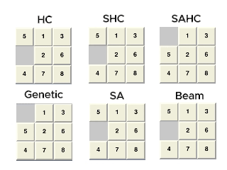

# AI Puzzle 8 - Trò chơi mô phỏng thuật toán AI

## 1. Giới thiệu
Đây là một ứng dụng mô phỏng giải bài toán Puzzle 8 (8-puzzle) sử dụng nhiều thuật toán trí tuệ nhân tạo (AI). Người dùng có thể nhập trạng thái ban đầu, chọn thuật toán và quan sát quá trình giải bài toán trực quan trên giao diện đồ họa.

## 2. Tính năng
- Hỗ trợ nhiều thuật toán AI kinh điển:
  - BFS (Breadth-First Search)
  - DFS (Depth-First Search)
  - IDDFS (Iterative Deepening DFS)
  - UCS (Uniform Cost Search)
  - A*
  - IDA*
  - Greedy Best-First Search
  - Hill Climbing (HC, SHC, SAHC)
  - Simulated Annealing (SA)
  - Genetic Algorithm
  - Beam Search
  - Belief Search
  - Partial Order Search (POS)
  - Min Conflict
  - And-Or Search
  - Backtracking, Backtracking Forward
  - Q-learning
- Giao diện trực quan với Pygame, dễ dàng thao tác và quan sát từng bước giải.
- Cho phép nhập trạng thái tùy ý, xáo trộn ngẫu nhiên, hoặc chọn trạng thái dễ.
- Hiển thị chi phí, thời gian thực thi và các bước di chuyển.


## 3. Cách sử dụng
1. Cài đặt Python và thư viện Pygame:
   ```bash
   pip install pygame
   ```
2. Chạy file `BaiTapCaNhan_Ai_puzzle8.py`:
   ```bash
   python BaiTapCaNhan_Ai_puzzle8.py
   ```
3. Nhập trạng thái, chọn thuật toán và nhấn nút để xem quá trình giải.

## 4. Nội dung

### Các thành phần chính của bài toán 8-Puzzle
Bài toán 8-Puzzle có thể được mô tả chính thức với các thành phần sau:

- Trạng thái (State): Một cấu hình cụ thể của 8 ô số (từ 1 đến 8) và một ô trống (thường ký hiệu là 0) trên một lưới 3x3.
- Trạng thái ban đầu (Initial State): Cấu hình xuất phát của bài toán mà người dùng cung cấp hoặc được tạo ngẫu nhiên.
- Trạng thái đích (Goal State): Cấu hình mong muốn cần đạt tới. Thông thường là [[1, 2, 3], [4, 5, 6], [7, 8, 0]].
- Hành động (Actions): Các phép toán có thể thực hiện để chuyển từ trạng thái này sang trạng thái khác. Trong 8-Puzzle, hành động là di chuyển ô trống theo một trong bốn hướng: Lên (Up), Xuống (Down), Trái (Left), Phải (Right), nếu nước đi đó hợp lệ (không ra ngoài biên).
- Hàm chuyển đổi (Transition Model): Mô tả kết quả của việc thực hiện một hành động từ một trạng thái. Ví dụ, nếu ô trống ở giữa và hành động là "Lên", ô trống sẽ đổi chỗ với ô số phía trên nó.
- Chi phí đường đi (Path Cost): Chi phí để đi từ trạng thái ban đầu đến một trạng thái n. Trong bài toán 8-Puzzle cơ bản, mỗi bước di chuyển ô trống thường có chi phí là 1.

### Solution (Lời giải) là gì?
Một lời giải cho bài toán 8-Puzzle là một chuỗi các hành động (các bước di chuyển ô trống) dẫn từ trạng thái ban đầu đến trạng thái đích. Mục tiêu của các thuật toán tìm kiếm là tìm ra một lời giải như vậy, và tùy thuộc vào thuật toán, lời giải đó có thể là tối ưu (ngắn nhất) hoặc không.

### Uninformed Search Algorithms

- BFS (Breadth-First Search)
- DFS (Depth-First Search)
- IDDFS (Iterative Deepening DFS)
- UCS (Uniform Cost Search)


### Informed Search Algorithms

- A*
- IDA*
- Greedy Best-First Search



### Local Search

- Hill Climbing (HC, SHC, SAHC)
- Simulated Annealing (SA)
- Genetic Algorithm
- Beam Search



### Searching in Complex Environments

- Belief Search
- Partial Order Search (POS)


### Constraint Satisfaction Problems

- Min Conflict
- And-Or Search
- Backtracking, Backtracking Forward

### Reinforcement Learning
 
- Q-learning

## Đóng góp
Mọi đóng góp, ý kiến hoặc báo lỗi xin gửi về [GitHub repository](https://github.com/NDKhoa30102005/AI).

## Tác giả
- Nguyễn Đăng Khoa
