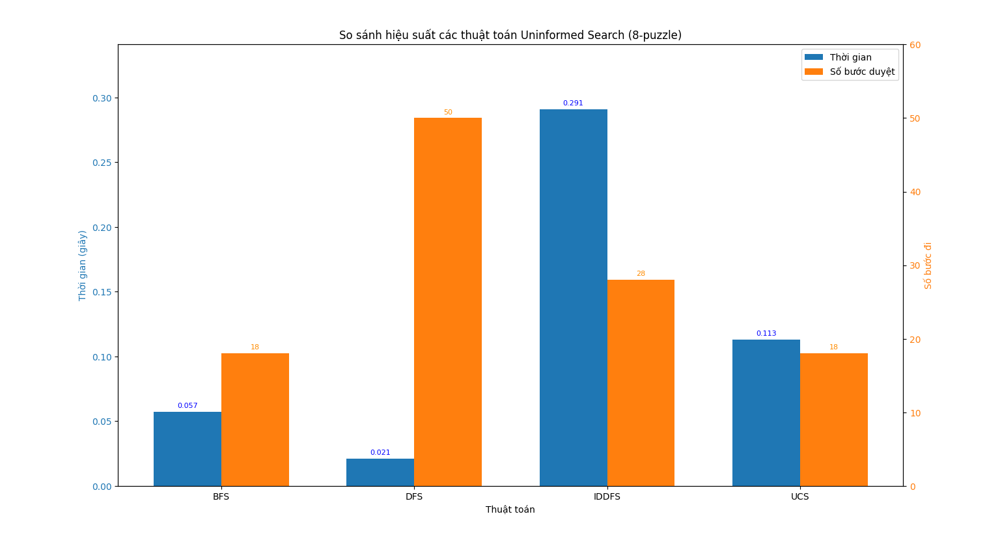

# AI Puzzle 8 - Trò chơi mô phỏng thuật toán AI

## 1. Giới thiệu
Đây là một ứng dụng mô phỏng giải bài toán Puzzle 8 (8-puzzle) sử dụng nhiều thuật toán trí tuệ nhân tạo (AI). Người dùng có thể nhập trạng thái ban đầu, chọn thuật toán và quan sát quá trình giải bài toán trực quan trên giao diện đồ họa.

## 2. Tính năng
- Hỗ trợ nhiều thuật toán AI kinh điển:
  - BFS (Breadth-First Search)
  - DFS (Depth-First Search)
  - IDDFS (Iterative Deepening DFS)
  - UCS (Uniform Cost Search)
  - A*
  - IDA*
  - Greedy Best-First Search
  - Hill Climbing (HC, SHC, SAHC)
  - Simulated Annealing (SA)
  - Genetic Algorithm
  - Beam Search
  - Belief Search
  - Partial Order Search (POS)
  - Min Conflict
  - And-Or Search
  - Backtracking, Backtracking Forward
  - Q-learning
- Giao diện trực quan với Pygame, dễ dàng thao tác và quan sát từng bước giải.
- Cho phép nhập trạng thái tùy ý, xáo trộn ngẫu nhiên, hoặc chọn trạng thái dễ.
- Hiển thị chi phí, thời gian thực thi và các bước di chuyển.


## 3. Cách sử dụng
1. Cài đặt Python và thư viện Pygame:
   ```bash
   pip install pygame
   ```
2. Chạy file `BaiTapCaNhan_Ai_puzzle8.py`:
   ```bash
   python BaiTapCaNhan_Ai_puzzle8.py
   ```
3. Nhập trạng thái, chọn thuật toán và nhấn nút để xem quá trình giải.

## 4. Nội dung

### Các thành phần chính của bài toán 8-Puzzle
Bài toán 8-Puzzle có thể được mô tả chính thức với các thành phần sau:

- Trạng thái (State): Một cấu hình cụ thể của 8 ô số (từ 1 đến 8) và một ô trống (thường ký hiệu là 0) trên một lưới 3x3.
- Trạng thái ban đầu (Initial State): Cấu hình xuất phát của bài toán mà người dùng cung cấp hoặc được tạo ngẫu nhiên.
- Trạng thái đích (Goal State): Cấu hình mong muốn cần đạt tới. Thông thường là [[1, 2, 3], [4, 5, 6], [7, 8, 0]].
- Hành động (Actions): Các phép toán có thể thực hiện để chuyển từ trạng thái này sang trạng thái khác. Trong 8-Puzzle, hành động là di chuyển ô trống theo một trong bốn hướng: Lên (Up), Xuống (Down), Trái (Left), Phải (Right), nếu nước đi đó hợp lệ (không ra ngoài biên).
- Hàm chuyển đổi (Transition Model): Mô tả kết quả của việc thực hiện một hành động từ một trạng thái. Ví dụ, nếu ô trống ở giữa và hành động là "Lên", ô trống sẽ đổi chỗ với ô số phía trên nó.
- Chi phí đường đi (Path Cost): Chi phí để đi từ trạng thái ban đầu đến một trạng thái n. Trong bài toán 8-Puzzle cơ bản, mỗi bước di chuyển ô trống thường có chi phí là 1.

### Solution (Lời giải) là gì?
Một lời giải cho bài toán 8-Puzzle là một chuỗi các hành động (các bước di chuyển ô trống) dẫn từ trạng thái ban đầu đến trạng thái đích. Mục tiêu của các thuật toán tìm kiếm là tìm ra một lời giải như vậy, và tùy thuộc vào thuật toán, lời giải đó có thể là tối ưu (ngắn nhất) hoặc không.

### Uninformed Search Algorithms

- Breadth-First Search (BFS): duyệt theo chiều rộng, mở rộng các trạng thái theo từng lớp.

- Depth-First Search (DFS): duyệt theo chiều sâu, đi càng xa càng tốt theo một nhánh rồi mới quay lại.

- Uniform Cost Search (UCS): mở rộng nút có chi phí nhỏ nhất từ gốc đến trạng thái đó.

- Iterative Deepening DFS (IDDFS): kết hợp giữa DFS và BFS bằng cách tìm theo mức sâu giới hạn tăng dần.





#### Nhận xét

-  BFS tìm được lời giải ngắn nhất nếu chi phí di chuyển đồng đều nhưng rất tốn bộ nhớ và chạy chậm khi độ sâu tăng chỉ phù hợp cho nhưng bài toán nhỏ.
-  DFS có ưu điểm là ít tốn bộ nhớ hơn chạy nhanh hơn BFS nhưng dễ rơi vào các nhanh sâu vô ích không đảm bảo tìm được lời giải tốt nhất.
-  UCS luôn tìm ra lời giải tối ưu nếu chi phí chính xác nhưng nó có hiệu suất kém nếu không gian tìm kiếm lớn
- IDDFS là sự kết hợp ưu điểm của BFS và DFS ít tốn bộ nhớ hơn BFS nhưng phải lặp lại nhiều lần đôi khi không hiệu quả chỉ thanh thế BFS khi bộ nhớ hạn chế.

### Informed Search Algorithms

- Greedy Best-First Search: chọn trạng thái có giá trị heuristic nhỏ nhất (tức gần mục tiêu nhất).

- A*: kết hợp giữa chi phí từ gốc đến hiện tại (g(n)) và ước lượng chi phí đến đích (h(n)) → f(n) = g(n) + h(n).

- IDA*: phiên bản lặp sâu dần của A* để tiết kiệm bộ nhớ.

#### Các heuristic phổ biến trong 8-Puzzle:

- Số ô sai vị trí (Misplaced tiles)

- Tổng khoảng cách Manhattan


#### Nhận xét

- A* tối ưu nếu heuristic nhanh và hiệu quả với bài toán nhưng không đảm bảo tìm ra giải pháp tối ưu nhất. Dùng khi cần lời giải nhanh chấp nhận không tối ưu.
- Greedy Best-First Search Nhanh, tập trung mở rộng các trạng thái gần đich nhưng không đảm bảo lời giải tối ưu dễ mắc vào những không gian trạng thái phức tạp
- IDA* là một giải pháp thay thế cho A* khi bộ nhớ bị hạn chế, có thể thời gian chạy sẽ lâu hơn.

Tóm lại các thuật toán tìm kiếm có thông tin có sử dụng hàm tính chi phí (heuristic) giúp giảm số node phải duyệt trong đáng kể so nhóm thuật toán Uninformed Search Algorithms đặt biệt là trong bài toán puzzle 8 này
 

### Local Search

- Hill Climbing (leo đồi đơn giản): luôn chọn trạng thái "cao" hơn (tốt hơn) theo hàm heuristic.

- Steepest-Ascent hill-climbing (leo đồi dốc nhất): luôn chọn những lân cận 
gần nhất với trạng thái mục tiêu

- Stochastic hill Climbing (Leo đồi ngẫu nhiên): ở thuật toán này thay vì chọn chọn ra những lân cận tốt nhất thì nó sẽ chọn ngẫu nhiên một hàng xóm nếu trạng thái đó tốt hơn hiện tại.

- Simulated Annealing là sự kết hợp của hai kỹ thuật “hill climbing” (leo đồi) và “pure random walk” (bước đi ngẫu nhiên thuần túy). Kỹ thuật hill climbing giúp tìm giá trị cực trị toàn cục, còn kỹ thuật pure random walk giúp tăng hiệu quả tìm kiếm giá trị tối ưu. Nếu giải pháp mơi không tốt hơn giải pháp củ có thể giữ lại với xác suất $P = e^{-\Delta E / T}$

- Genetic Algorithm (GA) — hay Thuật toán di truyền — là một thuật toán tối ưu hóa và tìm kiếm dựa trên quá trình tiến hóa tự nhiên của sinh vật do Charles Darwin đề xuất: chọn lọc tự nhiên và di truyền học.
   - GA mô phỏng cách quần thể sinh vật tiến hóa qua các thế hệ để tìm ra cá thể tốt nhất (lời giải tối ưu). Các thuật toán này sử dụng các phép toán tương tự như:

   - Chọn lọc (Selection): chọn các cá thể tốt để sinh sản.

   - Lai ghép (Crossover): kết hợp thông tin di truyền từ hai cá thể để tạo ra thế hệ mới.

   - Đột biến (Mutation): thay đổi ngẫu nhiên một phần thông tin để duy trì đa dạng.


- Beam Search: chỉ mở rộng một số trạng thái tốt nhất tại mỗi bước.


#### Nhận xét

- Hill Climbing, Steepest-Ascent hill-climbing, Stochastic hill Climbing là các thuật toán đơn giản trong bài toán dễ nhưng nhược điểm là rất dễ mắc kẹt tại các cực trị cục bộ không thể giải được các thái có trạng thái ban đầu khó không phù hợp với 8 puzzle.

- Slimulated Annealing có cải tiến hơn so với hill climbing có khả năng thoát khỏi những cực trị cục bộ nhưng cần tinh chỉnh và thiết lập nhiệt độ và lịch giảm nhiệt độ phù hợp với bài toán của mình. Có thể không tìm được lời giải, không ổn định với 8 puzzle.

- Beam Search có ưu điểm là giúp hạn chế số lượng trạng thái cần mở rộng giúp tiết kiệm bộ nhớ nhưng dễ bỏ lở các lời giải do mở rộng hạn chế. Dù vậy nhưng thuật toán này mang lại tốc độ giải quyết bài toán rất nhanh.

- Genetic Algorithm phù hợp cho các bài toán khó mô hình hóa chính xác, có không gian lời giải lớn, có thể thoát khỏi cực trị địa phương. Nhược điểm hiệu suất phải phụ thuộc vào tham số ban đầu như kích thước quần thể, xác suất lai/đột biến... cần tinh chỉnh cho phù hợp với bài toán. Thường chạy rất chậm nếu không tối ưu tốt và không đảm bảo tìm được lời giải.

Tóm lại thì ở nhóm thuật toán local search có thể tìm ra lời giải nhanh trong một số trường hợp nhưng thường thì dễ mắt kẹt ở các giá trị cực trị cục bộ. Với 8 puzzle thì nhóm thuật toán này chỉ nên dùng để tham khảo.

### Searching in Complex Environments

- Belief Search: Thay vì tìm kiếm trên các trạng thái xác định, thuật toán tìm trên danh sách "trạng thái niềm tin"(belief state) tức là tập hợp các trạng thái mà agent không biết mình đang ở trạng thái nào. Thuật toán sẽ thực hiện cùng 1 hành động niềm tin cho các trạng thái niềm tin ban đầu để tạo ra một danh sách trạng thái niềm tin mới thực hiện đến khi nào tất cả các trạng thái ban đầu đều là đích. Có thể dùng BFS, DFS hay A* để tìm kiếm.

- Partial Order Search (POS) Không cần xác định thứ tự đầy đủ các hành động, mà chỉ xác định thứ tự cục bộ cần thiết giữa các hành động (partial order). Điều này giúp linh hoạt hơn và tránh các thứ tự dư thừa.

- And Or Search:Thay vì tìm một đường đi tuyến tính (như trong OR-tree), ta cần tìm một cây kế hoạch.

   - AND-nút: Tất cả các con phải được giải.
   - OR-nút: Chỉ cần một trong số con được giải.


#### Nhận xét
- Belief search thuật toán này thật chất ko phù hợp với bài toán 8 puzzle bời mình luôn biết được trạng thái hoàn toàn. Thuật toán chạy rất lâu và tốn bộ nhớ vì duyệt qua và lưu rất nhiều trạng thái niềm phụ thuộc vào số trạng thái niềm tin ban đầu nhưng vẫn đảm bảo tìm được đường đi.

- POS là lựa chọn hợp lý nhất nếu muốn cân bằng giữa hiệu suất xử lý và quy mô không gian trạng thái, nhờ khả năng quan sát một phần giúp loại trừ sớm các khả năng sai lệch.

- AND-OR Search có tốc độ xử lý nhanh nhưng lại phát sinh nhiều nhánh không cần thiết, thích hợp hơn khi trạng thái ban đầu đã gần sát mục tiêu và không yêu cầu thu hẹp không gian tìm kiếm.

### Constraint Satisfaction Problems

- Backtracking duyệt từng biến, gán giá trị cho biến đó. Nếu phát hiện vi phạm ràng buộc → quay lui (backtrack). Tiếp tục thử giá trị khác cho biến trước đó

- Backtracking Forward mỗi khi gán giá trị cho một biến, loại bỏ những giá trị không hợp lệ trong miền giá trị của các biến chưa gán Nếu một biến chưa gán có miền trống (không còn giá trị khả thi) → backtrack sớm.

- Min Conflict bắt đầu với một gán ngẫu nhiên (có thể sai). Ở mỗi bước, chọn một biến đang vi phạm ràng buộc và gán lại giá trị sao cho số xung đột là ít nhất.


   
#### Nhận xét

- Backtracking thuật toán có tốc độ chậm, dễ quay lui nhiều lần nhưng đảm bảo tìm được lời giải nếu có.

- Backtracking Forward cái tiến hơn so với Backtracking thông thường giảm được số lần quay lui không cần thiết, phát hiện sớm sự mâu thuẫn nhờ kiểm tra trước. Dù vậy thì thuật toán chỉ mang lại cải thiện nhỏ so với backtracking thuần túy.

- Min Conflict có ưu điểm là thường giải rất nhanh cho bài toán lớn nhưng có thể kẹt tại các cực trị cục bộ không tìm ra được giải pháp.


### Reinforcement Learning
Reinforcement Learning (RL) là phương pháp học thông qua tương tác với môi trường. Tác tử (agent) học cách hành động thông qua thử và sai, nhận lại phần thưởng (reward) cho các hành động và dần dần học được chính sách tối ưu.

- Mô hình RL cơ bản bao gồm:

   - Agent: tác tử thực hiện hành động.

   - Environment: môi trường (ví dụ: lưới 8-puzzle).

   - State (trạng thái): tình huống hiện tại của bài toán.

   - Action (hành động): di chuyển các ô.

   - Reward (phần thưởng): thường là âm cho mỗi bước đi (để khuyến khích giải nhanh).

   - Policy (chính sách): chiến lược chọn hành động.

   - Value Function: giá trị kỳ vọng từ một trạng thái.

- Q-learning: xây dựng bảng Q[state][action] để học giá trị của từng hành động ở mỗi trạng thái.


#### Nhận xét
- Thuật toán Q-learning mang lại lời giải tốt nhất sau khi học nhưng cần thời gian tìm kiếm quá lâu. Dù vậy Q-learning không tối ưu trong bài toán puzzle do môi trường không quá phức tạp.

## 5. Tác giả
# Sinh viên: Nguyễn Đăng Khoa - 23110242

